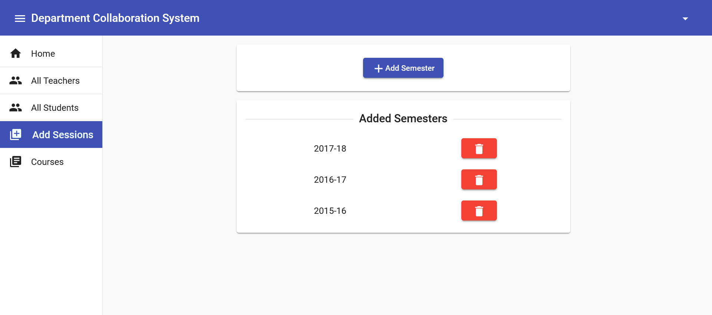
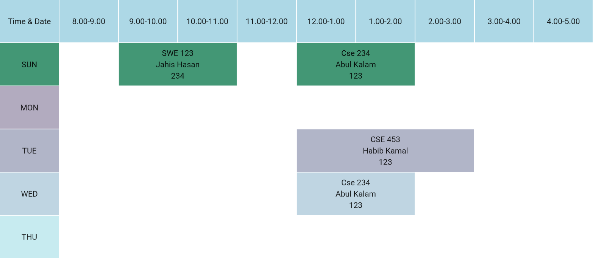

# WebTech-Project

There is no doubt that our world is becoming more and more digital. A
digital system reduces both the human effort and errors which enables us to
perform more efficiently than a manual system ever will. So in order to cope
with the modern digitalized world our project is a try to make the collaboration
activities of our department online which will help us to make the best use of
our resources.

## Database

This project consists of 7 data tables. Which are :


## Backend Api Calls

### User related

###

- Without any authorization

  - Login User : `POST /api/user/login/`

    ```json
    Request Body
    {
        "email":"useremail@email.com",
        "password":"xxxxxxxx"
    }
    ```

  - Register Admin : `POST /api/users/`

    ```json
    Request Body
    {
        "name": "Admin1",
        "email": "a1@ex.com",
        "password": "123123123",
        "role": "admin"
    }
    ```

  - Register Teachers : `POST /api/users/`

    ```json
    Request Body
    {
        "name": "Techer1",
        "email": "t1@ex.com",
        "password": "123123123",
        "role": "teacher",
        "profile": {
            "designation": "Professor"
        }
    }
    ```

  - Register Student : `POST /api/users/`

    ```json
    Request Body
    {
        "name": "Student1",
        "email": "s1@ex.com",
        "password": "123123123",
        "role": "student",
        "profile": {
            "sessionId": 1,
            "registration": 2017831020
        }
    }
    ```

### User Table

To register an user, we collect all the the data and insert the data into data tables as their roles.


In this table, basic information like `id, name, password and role` are stored in the `User` table. Other basic information like:

- In `Student` table we store: `registration number, sessionId`
- In `Teacher` table we store : `designation`

```
When we fetch the data (Joining both the User table and corresponding role based table) to show the detailed information.
```

#

- Authorized And Performed By User Himself

  - Get Profile : `GET /api/users/me`
  - Logout User : `POST /api/users/logout`

## Session related

###

- With Admin Authorization

  - Create Session: `POST /api/sessions`

    ```json
    Request Body
    {
        "session" : "2018-19"
    }
    ```

- With Users Authorization
  - Get Session: `GET /api/sessions`

## Course Related

###

- With Admin Authorization

  - Create Course : `POST /api/courses`

    ```json
    Request Body
    {
        "title": "Introduction to software engineering",
        "credit": 3,
        "is_optional": false,
        "semester": "3/2",
        "details": "Very important course",
        "adminId": 1
    }
    ```

- With Users Authorization
  - Get Courses : `GET /api/courses`
  - New Request : `GET /api`

## Routine Related

###

- With Teacher Authorization

  - Create Routine : `POST /api/routine`

    ```json
    Request Body
    {
        "id":1,
        "user_id":1,
        "courseTitle":"Cse 234",
        "instructorName":"Abul Kalam",
        "booldays":"TFFTF",
        "startTime":"12:00 PM",
        "endTime":"2:00 PM",
        "roomNum":"123"
    }
    ```

After creating up a routine, a teacher can post the routine session-wise. These requires association between `Routine` table and `Session` table.

## Data Visualization


### Teachers info


### Students info


### Sessions info



### Courses info


### A Complete Routine




### Session-wise Routine


## Given Requirements

- [Minimum 5 Data Tables](#database)
- Data visualization from multiple table
  - [Teacher Info](#teachers-info)
  - [Students Info](#students-info)
  - [Session-Wise Routine](#session-wise-routine)
- Insert query in multiple tables
  - [User & Teacher](#user-table)
  - [User & Student](#user-table)
